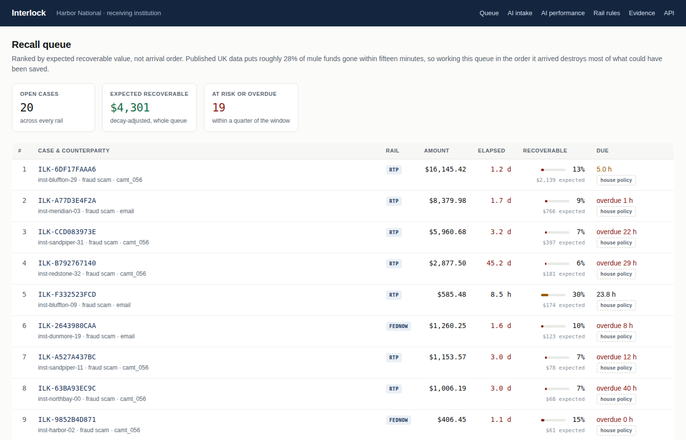
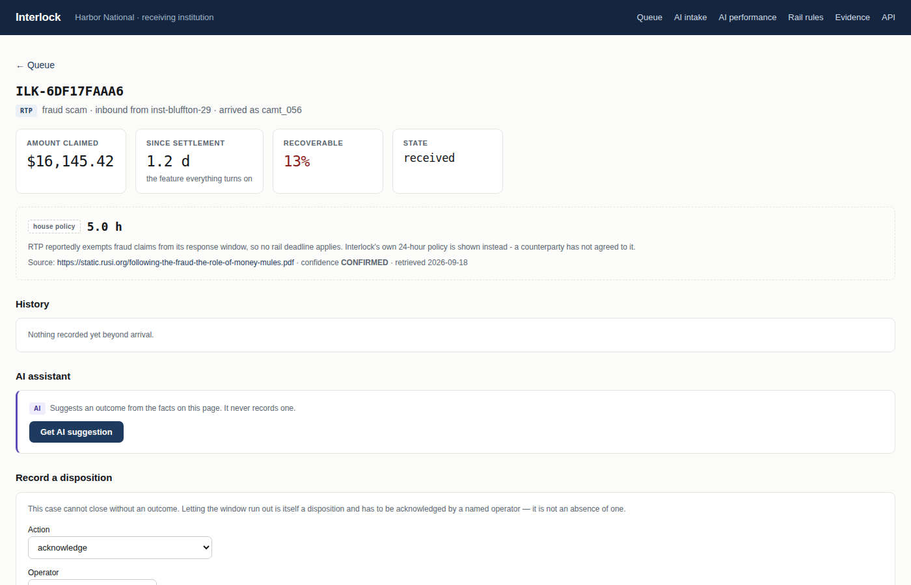
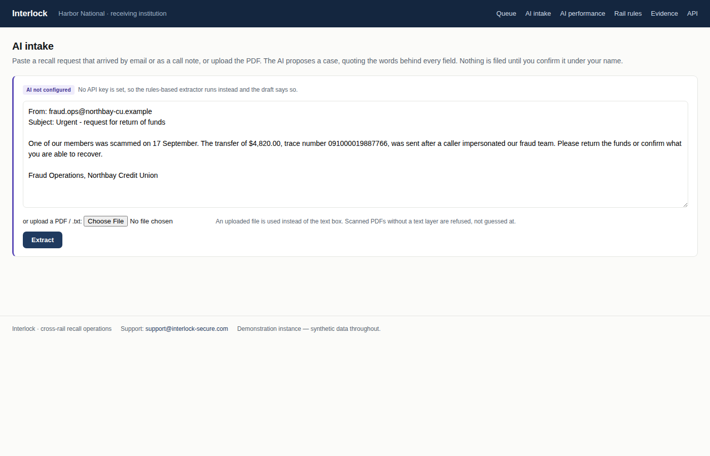
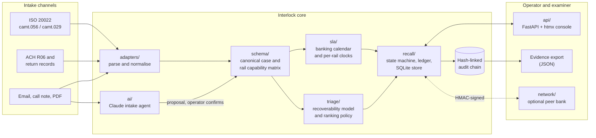
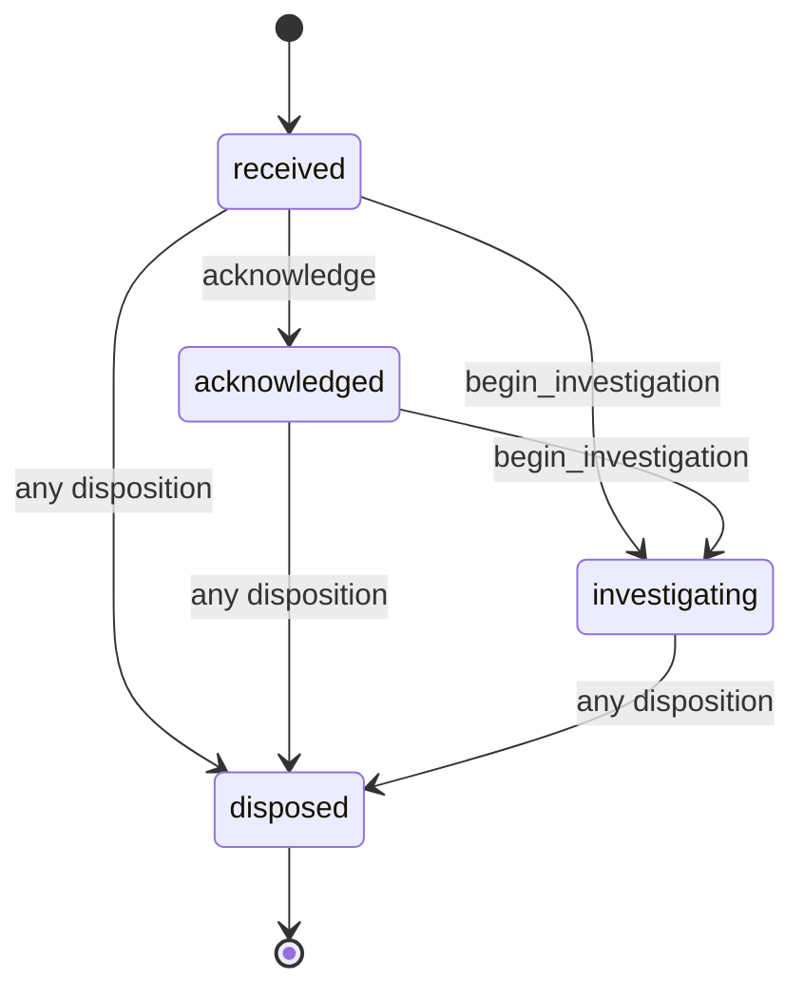
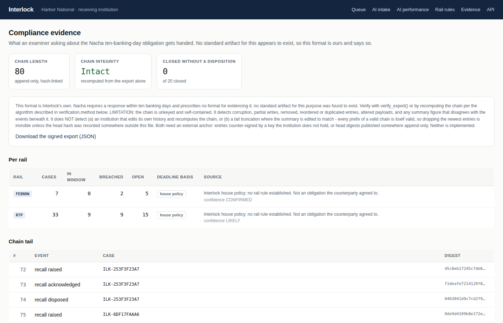

<div align="center">

# Interlock

**AI-assisted recall and return operations for US payment rails.**

One case, one clock and one audit trail for every "please send that money back" request, whether it arrives over ACH, RTP, FedNow or Fedwire.

[](https://github.com/interlock-secure/Interlock/actions/workflows/ci.yml)


[](https://github.com/astral-sh/ruff)
[](LICENSE)

[The problem](#the-problem) ·
[The solution](#the-solution) ·
[Architecture](#architecture) ·
[Results](#results) ·
[Getting started](#getting-started) ·
[Project structure](#project-structure)



</div>

> [!NOTE]
> **All data in this repository is synthetic.** No real institution's behaviour appears anywhere in it, and no figure it produces transfers to production. See [Limitations](#limitations-what-this-does-not-prove).

---

## Table of contents

- [Overview](#overview)
- [The problem](#the-problem)
- [The solution](#the-solution)
- [Key features](#key-features)
- [Architecture](#architecture)
- [The AI layer](#the-ai-layer)
- [Results](#results)
- [Tech stack](#tech-stack)
- [Project structure](#project-structure)
- [Getting started](#getting-started)
- [Testing and quality](#testing-and-quality)
- [Limitations: what this does not prove](#limitations-what-this-does-not-prove)
- [Roadmap](#roadmap)
- [Documentation](#documentation)
- [Authors](#authors)

## Overview

When a customer is tricked into sending money, their bank asks the receiving bank to return it. That request, a **recall**, is a race: published UK mule-account data puts roughly 28% of stolen funds gone within fifteen minutes. Yet banks still handle recalls through email, phone calls and portals, in arrival order, with a different process for each payment rail.

Interlock is the operations layer for that race. It:

1. **Normalises** a recall from any channel (ISO 20022 `camt.056`, an ACH R06 request, an email, a call note or a PDF) into one canonical case.
2. **Runs the right clock** for that rail, using a Federal Reserve banking calendar and rail rules that each carry a source and a confidence level.
3. **Ranks the queue** by expected recoverable dollars, not by arrival time.
4. **Uses AI to help operators**, reading unstructured requests, suggesting outcomes and drafting replies, while a named person makes every decision.
5. **Guarantees a recorded outcome.** A case cannot close without one, and every step is written to a tamper-evident audit chain that an examiner can verify.

It is built as a full product, from problem framing and specification through to a working console, an ML triage model, an AI assistant and a documented evaluation.

## The problem

Every US payment rail has a way to ask for money back. None has both a machine-readable format for the answer and an enforceable obligation to give one.

| Rail | Structured answer format | Obligation to respond | Response window |
|---|---|---|---|
| **ACH** | **None.** Nacha lets banks answer by portal or phone | **Mandatory** | **10 banking days, even when refusing** |
| RTP | `camt.029` | Mandatory | 10 banking days, fraud reportedly exempt |
| FedNow | `camt.029` | Advisory: Operating Circular 8 says "should" | None established |
| Fedwire | `camt.029` | Advisory | None stated |

**ACH has the obligation but no format; the instant rails have the format but no enforceable obligation.** A bank working all four runs four incompatible processes for one business event. The result:

- **Money is lost to delay.** Queues are worked first-in, first-out, so high-value, fast-decaying cases wait behind low-value ones.
- **Compliance is hard to evidence.** Nacha requires an ACH response within ten banking days but prescribes no artifact that proves it happened.
- **Requests arrive unstructured.** Many recalls come as emails or call notes that someone has to re-key by hand.
- **Cases go silent.** When a window expires with no answer, there is often no record that anyone decided anything.

## The solution

Interlock is built around three rules that run through the schema, the state machine, the storage layer and the test suite.

1. **No recall case closes without a recorded disposition.** A window expiring is itself an outcome that a named operator must acknowledge. This is enforced three times: the state machine has no path to a closed state without a disposition, the case object refuses to be built in that shape, and the database has `CHECK` constraints so a violating row cannot be written.
2. **Never return "low risk" when the real answer is "we don't know."** Missing information is shown as missing and is never filled with a default.
3. **Rail rules live in one place and carry their provenance.** Every deadline comes from `src/interlock/schema/rails.py` with a source URL and a confidence level. Code that depends on an unverified rule raises an error instead of guessing, and a static check fails the build if a deadline is written anywhere else.

## Key features

| Feature | What it does |
|---|---|
| **Multi-channel intake** | Parses ISO 20022 `camt.056` and `camt.029`, ACH R06 and return records, and free-text emails, call notes and PDFs into one case model |
| **Per-rail SLA clocks** | Computes deadlines on a Federal Reserve banking calendar, verified against the Fed's published 2026 and 2027 holiday dates |
| **Value-ranked queue** | Orders open cases by probability of recovery multiplied by amount, using a recovery-decay curve |
| **AI intake agent** | Claude reads an unstructured request and proposes a case, quoting the exact words behind every field |
| **AI next-step suggestion** | Suggests a legal next action for a case, with reasons drawn only from facts on the page |
| **AI reply drafting** | Writes the response to the requesting bank, checked so it contains no number that is not in the case |
| **Tamper-evident audit chain** | Every event is hash-linked, and an exportable evidence pack can be re-verified independently |
| **Compliance evidence export** | A JSON evidence pack with per-rail answered, breached and open counts, re-derived from the chain when verified |
| **Optional peer-to-peer mode** | Two Interlock instances can exchange recalls machine-to-machine using HMAC-signed requests |

<table>
  <tr>
    <td width="50%"></td>
    <td width="50%"></td>
  </tr>
  <tr>
    <td align="center"><em>Case page: deadline with its source, AI suggestion, disposition form</em></td>
    <td align="center"><em>AI intake: paste an email or upload a PDF</em></td>
  </tr>
</table>

## Architecture



### Request flow

1. **Arrive.** A recall comes in as a structured message or as free text. Structured messages go through a deterministic adapter; free text goes to the AI intake agent, or to a rules-based extractor when no API key is set.
2. **Normalise.** The result becomes a canonical case, versioned and PII-aware, defined in `src/interlock/schema/`.
3. **Clock.** The SLA module looks up the rail's rule in the capability matrix and computes the deadline on the banking calendar. Where no binding rule exists, it shows a clearly labelled house policy instead.
4. **Rank.** The triage policy scores the case's expected recoverable value, and the console orders the queue by it.
5. **Decide.** An operator moves the case through the state machine, with optional AI suggestions. Every step is written to the audit chain.
6. **Evidence.** The evidence export summarises compliance per rail. A verifier recomputes every figure from the chain itself.

### Case lifecycle



The seven dispositions are funds returned, partial return, funds frozen, insufficient funds, account holder disputes, declined with reason, and SLA expiry acknowledged. `disposed` has no outgoing transitions and there is no generic "close" action, so every route to the end passes through a recorded disposition, including an expired window. An exhaustive test walks all 66,430 transition sequences up to length five to prove it.



## The AI layer

Interlock uses Claude as an assistant to the operator in three places. The design rule is the same in each: **the model proposes, deterministic code checks, a named person decides, and the audit trail records whether they followed the AI.**

| Feature | Route | What the AI does | Guardrails enforced in code |
|---|---|---|---|
| **AI intake** | `/intake` | Reads a recall email, call note or PDF and proposes a case | Every value must quote the source text word for word or it is dropped. Amounts are checked digit by digit against their quote. Bank identities are never taken from the text. Nothing is filed until an operator confirms it |
| **AI suggestion** | case page | Suggests the next outcome, with reasons | Must be a legal action for the current state. May cite only facts it was given. Cannot suggest giving up before the deadline. Rejected answers are shown as rejected, never replaced with a default |
| **AI reply draft** | closed case | Writes the note back to the requesting bank | Must state the recorded outcome, case ID and exact amount. May contain no number that is not in the case. Never sent automatically |

Adoption is measured from evidence rather than a side log: whether the operator followed or overrode each suggestion is written to the audit chain, and the `/ai` page reports the follow rate and the most common overrides.

Four rounds of independent review found and closed real gaps, including wrong-amount extraction, prompt injection and forged adoption metrics. Each fix has a regression test, and the full record is in `docs/BUILD_LOG.md`.

> [!TIP]
> The AI is optional. Set `ANTHROPIC_API_KEY` to switch it on, and optionally `INTERLOCK_AI_MODEL` (default `claude-sonnet-5`). Without a key, every AI panel says "not configured" and intake falls back to the labelled rules-based extractor.

## Results

All figures below come from reports committed in `docs/eval/` and can be regenerated with the commands in [Reproducing the evaluations](#reproducing-the-evaluations). They are measured on synthetic data.

### Triage: dollars recovered under a fixed analyst capacity

The triage model is judged on recovered dollars per analyst-hour, not accuracy, against three other policies on the same held-out queue: **arrival order** (what banks do today), **largest amount first** (a strong heuristic that needs no model) and an **oracle** with perfect knowledge (the ceiling). Mean over five seeds:

| Cases worked per hour | Arrival order | Largest first | **Interlock model** | Oracle (ceiling) |
|---:|---:|---:|---:|---:|
| 5 | $97 | $2,415 | **$22,453** | $48,793 |
| 10 | $3,109 | $30,246 | **$36,292** | $57,365 |
| 20 | $3,619 | $36,775 | **$44,276** | $64,530 |
| 40 | $3,961 | $44,847 | **$53,012** | $70,584 |
| 60 | $4,683 | $51,882 | **$56,380** | $73,237 |
| 100 | $5,601 | $59,985 | **$61,414** | $74,755 |

- **At scarce capacity (5 cases an hour)** the model captures 46% of the achievable ceiling, against 5% for largest-first and 0.2% for arrival order.
- **Against largest-first,** the model never lost a seed at capacities 5 to 60. It lost one seed at 100, where there is enough capacity that ranking stops mattering, and the report says so.
- **Model selection:** logistic regression (Brier 0.0856, AUC 0.698) matched or beat gradient boosting (Brier 0.0858, AUC 0.665), so the simpler model ranks the queue. AUC was deliberately traded for leakage correctness: features cannot read post-outcome fields, and counterparty features use only cases that had already closed.

### Intake extraction: rules-based baseline

Scored on a labelled set of 23 messages, 6 of them prompt-injection attempts. Abstaining when the text supports no value is counted separately and never as an error.

| Field | Precision | Coverage |
|---|---:|---:|
| Amount | 94% | 94% |
| Payment reference | 100% | 95% |
| Reason | 100% | 71% |

**Injection resistance: 100%.** One hallucinated amount, on a keying-error message that quotes two figures.

> [!IMPORTANT]
> **The AI extractor's own accuracy has not been measured yet.** No API key was available where this was built, so every AI test uses scripted model outputs. The evaluation command exists and reports "NOT RUN" rather than an estimate.

### Engineering quality

| Measure | Result |
|---|---|
| Tests | 568 (567 passing, 1 skipped) |
| Line and branch coverage | 92.8%, CI gate at 70% |
| Disposition guarantee | 66,430 exhaustive sequences plus 2,000 Hypothesis-generated ones |
| Lint and format | Ruff, clean |

## Tech stack

| Layer | Tools |
|---|---|
| Language | Python 3.12+ (3.13 in CI and deployment) |
| Web and API | FastAPI, Uvicorn, Jinja2, htmx (served locally) |
| Data and validation | Pydantic v2, SQLModel, SQLite with `CHECK` constraints |
| Payment messaging | ISO 20022 XML via `defusedxml`, Nacha ACH records |
| Machine learning | scikit-learn (logistic regression, gradient boosting), NumPy, pandas |
| Generative AI | Anthropic Claude via the Anthropic SDK, with structured outputs |
| Documents | `pypdf` for PDF intake |
| Testing | pytest, Hypothesis, pytest-cov, Locust |
| Tooling | uv, Ruff, GitHub Actions |
| Deployment | Docker, Render blueprint, Vercel |

## Project structure

```text
Interlock/
├── src/interlock/
│   ├── schema/          # The product contract
│   │   ├── case.py          # Canonical recall case
│   │   ├── rails.py         # Rail capability matrix: every deadline, with source and confidence
│   │   ├── audit.py         # Hash-linked audit chain
│   │   ├── export.py        # Evidence export format
│   │   ├── pii.py           # PII allowlist: no unreviewed field can reach a wire message
│   │   └── versioning.py    # Schema versions and compatibility
│   ├── adapters/        # Inbound and outbound formats
│   │   ├── iso20022.py      # camt.056 recall and camt.029 resolution
│   │   ├── ach.py           # ACH R06 requests and return records
│   │   ├── freetext.py      # Rules-based extraction from emails and call notes
│   │   ├── documents.py     # PDF and text uploads
│   │   └── extraction_eval.py  # Labelled-set scoring harness
│   ├── sla/             # Federal Reserve banking calendar and per-rail clocks
│   ├── recall/          # State machine, disposition ledger, evidence, SQLite store
│   ├── triage/          # Features, recoverability model, ranking policy, evaluation harness
│   ├── generator/       # Synthetic payments, recall cases, recovery-decay model, counterparties
│   ├── ai/              # Claude client, intake agent, suggestions, reply drafting, metrics, eval
│   ├── api/             # FastAPI console (app.py), demo seeder, templates, static assets
│   ├── network/         # Optional HMAC-authenticated peer-to-peer mode
│   └── config.py        # Every setting, read from the environment
├── tests/
│   ├── unit/            # 23 test modules: invariants, calendar, AI guardrails, deployment
│   └── fixtures/        # Golden schema files and rail fixtures
├── docs/
│   ├── PRD_v2_0.docx    # Product specification
│   ├── BUILD_PLAN.md    # Strategy, milestones M0 to M10, and why v1.1 was replaced
│   ├── BUILD_LOG.md     # Decisions, trade-offs and review findings
│   ├── eval/            # Committed triage and extraction reports
│   ├── protocol/        # JSON Schemas and rails.md, generated from code
│   └── images/          # README screenshots
├── benchmarks/          # Synthetic testbed manifest (row counts and SHA-256 hashes)
├── .github/workflows/   # CI: lint, tests, schema compatibility
├── Dockerfile           # Non-root container with a chain-verifying health check
├── docker-compose.yml
├── render.yaml          # One-click Render deployment
├── vercel.json          # Vercel deployment
└── pyproject.toml
```

## Getting started

### Prerequisites

- Python 3.12 or later
- [uv](https://docs.astral.sh/uv/getting-started/installation/) for dependency management
- Optional: Docker, and an Anthropic API key for the AI features

### Run locally

```bash
git clone https://github.com/interlock-secure/Interlock.git
cd Interlock
uv sync --all-extras
uv run uvicorn interlock.api.app:app --reload
```

Open <http://127.0.0.1:8000>. The instance seeds its own demo queue deterministically, so it looks the same on every run. Interactive API documentation is at <http://127.0.0.1:8000/docs>.

To enable the AI features:

```bash
export ANTHROPIC_API_KEY=your-key-here
uv run uvicorn interlock.api.app:app --reload
```

### Run with Docker

```bash
docker compose up --build
```

> [!WARNING]
> The `Dockerfile` has been reviewed and its properties are asserted by tests (non-root user, health check on `/healthz`, database on a writable volume, virtualenv excluded from the build context), but it has not yet been built against a Docker daemon. Treat the first `docker compose up` as the real test.

### Deploy

- **Render:** choose **New**, then **Blueprint**, and point it at this repository. `render.yaml` configures a free-tier web service with the demo database in `/tmp`, re-seeded on each restart.
- **Vercel:** `vercel.json` and `[tool.vercel]` in `pyproject.toml` load `interlock.api.app:app` as an ASGI function.

### Configuration

Every setting is an environment variable. All defaults are in `src/interlock/config.py`.

| Variable | Default | Purpose |
|---|---|---|
| `INTERLOCK_SUPPORT_EMAIL` | `support@interlock-secure.com` | Support contact shown in the console footer, API description and health check |
| `INTERLOCK_INSTITUTION_NAME` | `Harbor National` | The institution this instance runs as |
| `INTERLOCK_DATABASE` | `data/interlock.db` | SQLite path; use `:memory:` for an ephemeral instance |
| `INTERLOCK_SEED_DEMO` | `1` | Seed the demo queue on an empty database |
| `INTERLOCK_DEMO_SEED` | `20260919` | Random seed that makes the demo reproducible |
| `ANTHROPIC_API_KEY` | unset | Turns on the AI features |
| `INTERLOCK_AI_MODEL` | `claude-sonnet-5` | Claude model used by the AI features |

The support address is defined once, in `config.py`, and a test walks the source tree to prove it is not hardcoded anywhere else.

### Console pages

| Page | Route | Purpose |
|---|---|---|
| Recall queue | `/` | Open cases ranked by expected recoverable value |
| Case | `/cases/{case_id}` | Deadline with source, history, AI suggestion, disposition form |
| AI intake | `/intake` | Turn an email, call note or PDF into a proposed case |
| AI performance | `/ai` | Follow rate and most common overrides, from the audit chain |
| Rail rules | `/rails` | The capability matrix, with sources and confidence levels |
| Evidence | `/evidence`, `/evidence.json` | Compliance summary and downloadable evidence pack |
| Health | `/healthz` | Liveness plus audit-chain verification |

## Testing and quality

```bash
uv run pytest                                          # full suite, with coverage gate
uv run pytest tests/unit/test_schema_golden.py --no-cov  # schema compatibility only
uv run ruff check . && uv run ruff format --check .    # lint and format
```

Tests worth knowing about:

- **The disposition guarantee** is checked over all 66,430 transition sequences up to length five and 2,000 Hypothesis-generated ones, including illegal moves. It is also checked against direct construction, `dataclasses.replace` and a corrupted database row, the three bypasses a review found that the transition walk could not see.
- **The banking calendar** is checked against the Federal Reserve's published dates for 2026 and 2027, including an asymmetry most implementations miss: a holiday on Saturday leaves Reserve Banks open the preceding Friday, while one on Sunday closes everything the following Monday.
- **Tamper detection** catches corruption, removed or reordered entries, altered payloads, and any summary figure that disagrees with the events beneath it.
- **Leakage is refused at runtime.** Feature code gets a read-only view of each case that raises on any post-outcome field or generator parameter, including reads through `getattr`.
- **Golden schema files** fail CI if a published schema model changes without a version bump.
- **Documentation drift:** `docs/protocol/rails.md` is generated from code, and a test fails if the two disagree. Another test checks that every path this README references exists.

CI runs three jobs on every push and pull request to `main`: lint and format, the full test suite, and a schema-compatibility check.

### Reproducing the evaluations

```bash
# Triage report (docs/eval/triage_report.txt)
uv run python -c "from interlock.triage.harness import evaluate, render_report; print(render_report(evaluate()))"

# Intake extraction report (docs/eval/ai_extraction_report.txt); set ANTHROPIC_API_KEY to score the AI too
uv run python -m interlock.ai.evaluate
```

## Limitations: what this does not prove

**What it proves:** that a cross-rail recall operations layer can be specified and built; that the rail obligation asymmetry is real and has engineering consequences; that triage under a decay curve beats queue order and, on this synthetic data, beats largest-amount-first at scarce capacity; and that a disposition guarantee can be enforced structurally rather than by policy.

**What it does not prove:**

- That any bank will buy it.
- That the recovery curve holds in the US. No US dataset was found, so the curve is calibrated from UK mule-account data and labelled as such wherever it is used.
- That the model figures mean anything outside this synthetic data.
- That the AI extractor is accurate. It has not been measured against a live model.
- That the optional network mode would attract participants.
- That the audit chain resists a determined insider. The chain is unkeyed, so an institution that edits its own history and recomputes the chain, or drops its newest entries and edits the summary to match, passes verification. Closing that gap needs an external anchor, which is not built, and the export says so in its own disclaimer.

Four rail rules could not be verified against a primary source, because the FedNow Operating Procedures, the RTP Operating Rules and the Nacha Rules Book are gated, disallow automated access or sit behind a paywall. They are marked `UNVERIFIED` in the matrix, surfaced on the console, and are not permitted to drive any deadline.

## Roadmap

- [ ] Measure the AI intake agent against the labelled set with a live model, and publish the figures next to the baseline
- [ ] Anchor the audit chain externally (counter-signed entries or published head digests) so insider edits become detectable
- [ ] Verify the four `UNVERIFIED` rail rules against primary sources
- [ ] Calibrate the recovery-decay curve on US data, if a source becomes available
- [ ] Build and publish the container image in CI
- [ ] Replace the peer-mode shared secret with mutual TLS

## Documentation

| Document | What it covers |
|---|---|
| `docs/PRD_v2_0.docx` | Product requirements: users, scope, success metrics |
| `docs/BUILD_PLAN.md` | Strategy, milestones M0 to M10 with acceptance criteria, and why the v1.1 signal-network framing was replaced |
| `docs/BUILD_LOG.md` | Decision record: trade-offs, defects found by review, and their fixes |
| `docs/protocol/rails.md` | Rail capability matrix, generated from code |
| `docs/eval/` | Committed evaluation reports |
| [CLAUDE.md](CLAUDE.md) and [AGENTS.md](AGENTS.md) | Working contract for humans and coding agents in this repository |

## Authors

- **Sai Prathap Reddy Cheluri**
- **Lekhashree Srinath Reddy**

Questions or issues: <support@interlock-secure.com>, or [open an issue](https://github.com/interlock-secure/Interlock/issues).

---

Released under the [MIT License](LICENSE).
